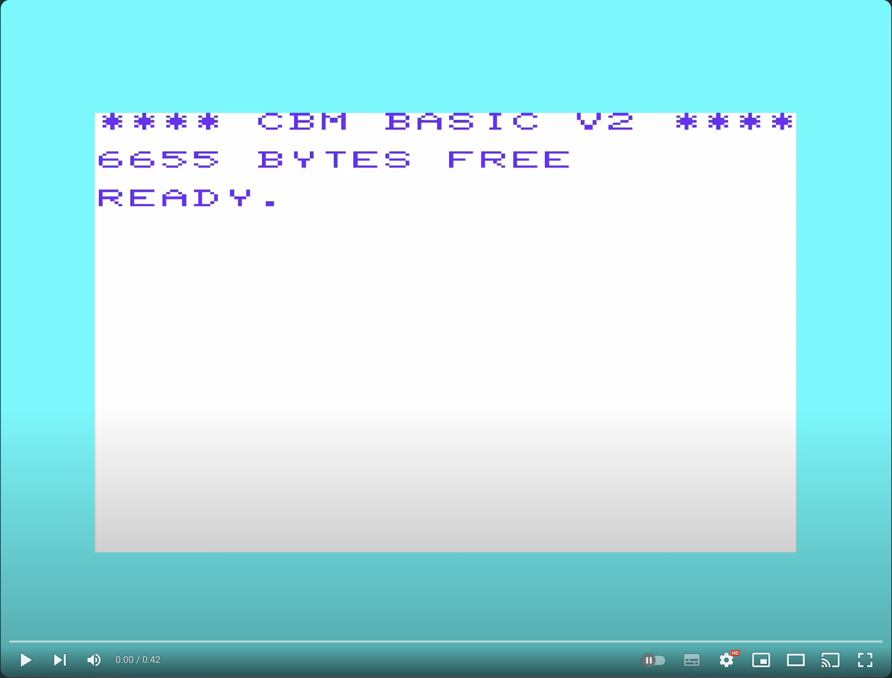
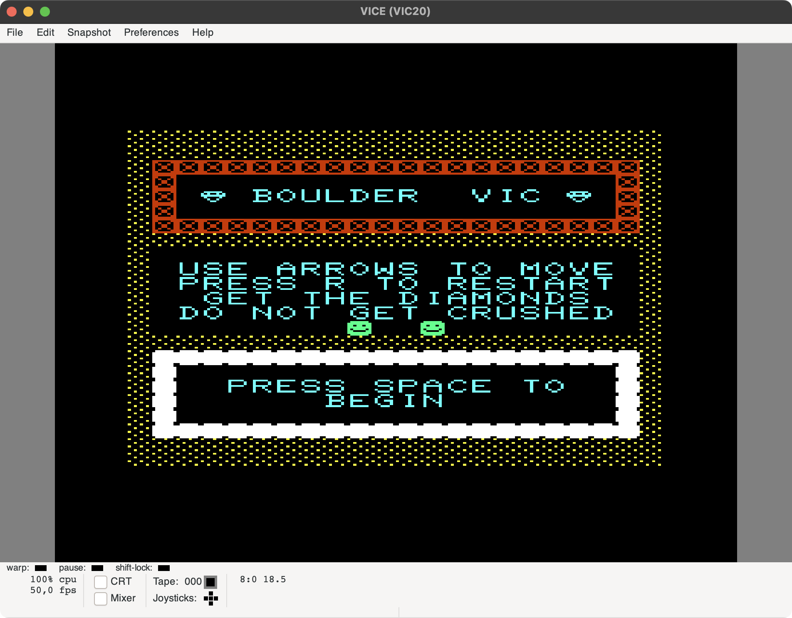
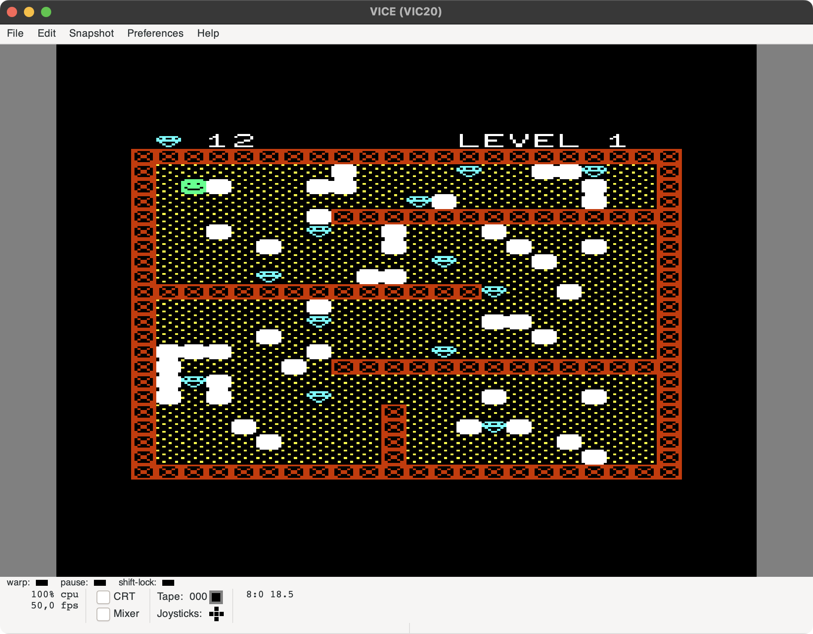
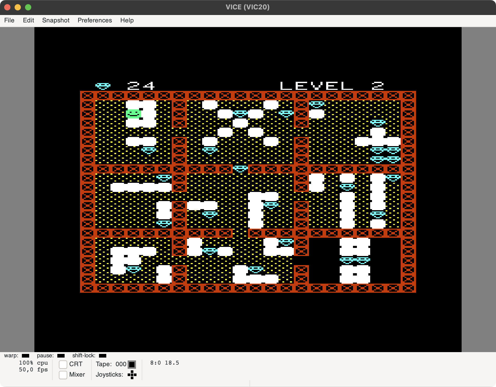
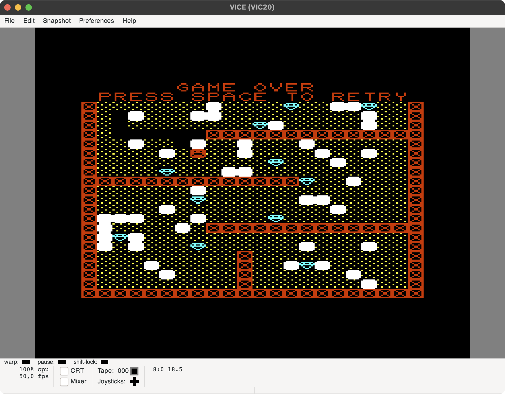

Boulder VIC
===

Description
---

This game is a Boulder Dash like game for the Commodore VIC-computer. I developped it as an exercice of C programming for old computers.

It does include:

- Not one, not three, but TWO (2) levels
- Colors (multiple !!)
- Sound
- Keyboard gameplay
  - arrow keys to move
  - `R` key to restart a level
- Basic gravity management (rocks and diamonds can fall, don't stay below)

It does not include:

- Crysis like graphics
- Possibility to push rocks
- Multi-screen levels

Requirements
---

A Vic-20 with 3 kB RAM expansion (no less, no more)

How to build
---

- Install Visual Code Studio + [VS64 extension](https://marketplace.visualstudio.com/items?itemName=rosc.vs64)
- Install [LLVM-MOS-SDK](https://github.com/llvm-mos/llvm-mos-sdk)
- Replace file `/path/llvm-mos-sdk/mos-platform/vic20/lib/link.ld` with the provided in the folder `extras` from this repository (make a backup before)
- Update `llvmPath` setting from `.vscode/c_cpp_properties.json` as needed
- (Optionnal) Install [VICE emulator] (https://vice-emu.sourceforge.io/), and set it's setting as needed. You may want to setup its drive to `Virtual device` with type `Host file system` and set the host directory to the `disk` file in this this repository

Charset
---

This game use a user defined charset with the needed characters for the game. This charset is build using:

- `resources/gencharset.sh` script, which takes all text files (except for `template.txt`) from `resources/chars` directory, and convert if to a binary file named `resources/charset.bin`. An empty template file is provided, and may be used to create new characters. Files MUST be named `char-id_anything-you-want.txt` (with `char-id` between 0 and 63).
- If you change the charset, you may modify `src/include/graphics.h` header file (`CHARSET_SIZE` value and `Charset new characters` section).
- The file `resources/charset.bin` is then copied to the `disk` directory of the repository

Levels
---

You may add new levels using:

- `resources/genlevels.sh` script, which takes all text files from `resources/levels` directory, and convert them to a binary file named `resources/level_<number>.bin`. Files MUST be named `level_<number>.txt` (with `char-id` between 0 and 63).
- If you change the levels, you may modify `src/include/gameplay.h` header file (`MAX_LEVEL` value).
- The files `resources/level_<number>.bin` are then copied to the `disk` directory of the repository

A special `resources/levels/title.txt` (and `resources/title.bin`) file is dedicated to the title screen, and is included in the above process.

Trivia
--- 

- There is no usage of `printf` and `sprintf` functions as they are too costly (about 3kB added when used with strings).

See on Youtube
---

Media
--- 

  

  

  

  

